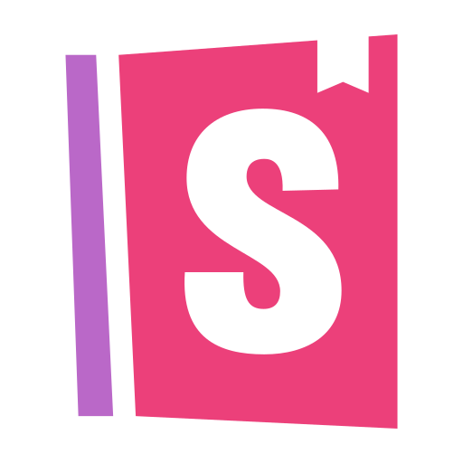

    

   

  

 

📍Maryland, USA     I'm <b>Al Amin.</b> <b> A Data Scientist</b>  

# ✍️ About Me:

I am a data professional with a strong analytical mindset and the ability to work collaboratively with teams. I am always committed to finding insights that can enhance business efficiency while aligning with strategic goals. Apart from my expertise in coding, I am passionate about teaching others about data science. I strive to make complex data science concepts easy to understand. Join me on this data-driven journey where we will work together to unlock insights, demystify data science, and help others prepare for a future of innovation.

Anyway, I don't want to steal anyone's time and I thank everyone who reads my profile.

## <b><i>I would be delighted to have an interview with a company that bets on me and the values I can bring, as I am sure I can bring many things.</i></b>

Thank you very much and see you in the “technological” networks.

P.S. I've been around the world and I'm preparing another one if anyone wants to join.  

### 🤝🏻 &nbsp;Connect with Me

  

  <kbd>
    <kbd>Tools</kbd>
     
     
    
    
    
    
    
    
      
    
    
    
    
    
    
       
    
    
    
  </kbd>   
  <kbd>
    <kbd>Data Science & AI</kbd>
     
     
    
    
    
    
    
    
      
    
    
    
    
  </kbd>  
  <kbd>
    <kbd>System, Networking & Deployment</kbd>
     
     
    
    
    
    
    
    
  </kbd>  
  <kbd>
    <kbd>Terminal Scripts</kbd>
     
     
    
    
    
  </kbd>  
  <kbd>
    <kbd>IDEs</kbd>
     
     
    
    
    
    
    
    
  </kbd>
  
  

  <!-- Profile Statistics -->

<h2>  Profile Statistics </h2>

  

    
      
  

        

<!-- Contribution Graph -->

<!-- Have a good day -->

<!-- Footer -->

